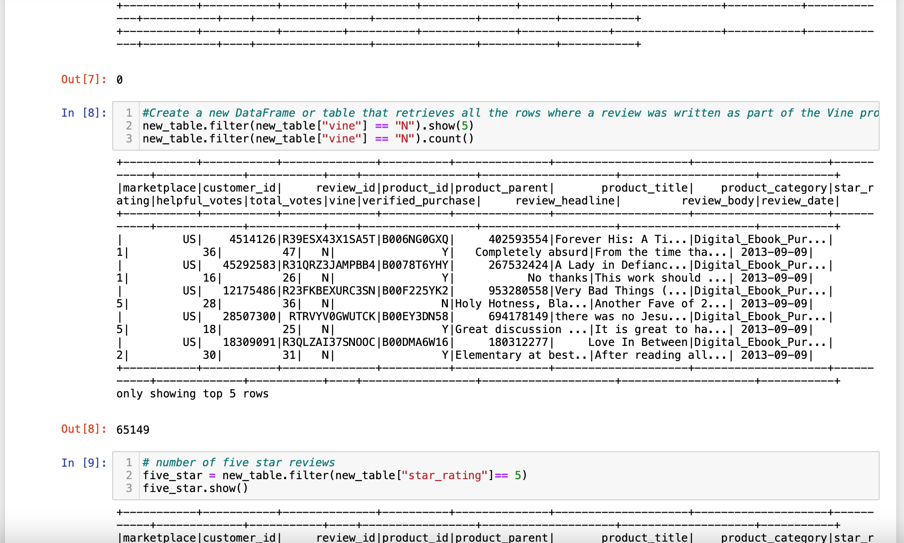
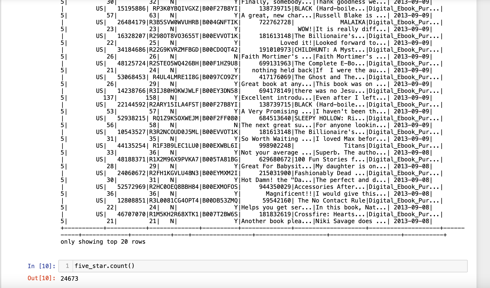
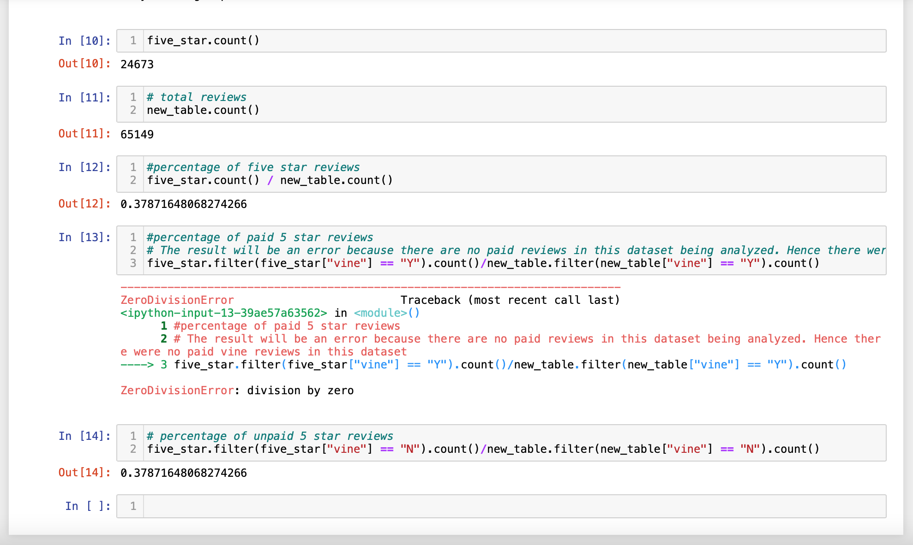

# Amazon_Vine_Analysis
## Overview of Analysis
The goal of this challenge was to analyze Amazon reviews written by paid Amazon Vine program members. Amazon Vine is a service that allows manufacturers and publishers to receive product reviews. I chose the US Digital Ebook Reviews dataset for this project and used PySpark to perform the ETL process to extract the dataset, transform the data, connect to an AWS RDS instance, and load the transformed data into pgAdmin. Next, I used PySpark, Pandas, or SQL to see if there is any bias toward positive Vine member reviews in your dataset.

### Tools
• PySpark
• Pandas
• Postgres

## Results
### How many Vine reviews and non-Vine reviews were there?
There weren't any vine reviews in our dataset, but there were a total of 65,149 non-vine reviews.

### How many Vine reviews were 5 stars? How many non-Vine reviews were 5 stars?
We can't tell how many Vine reviews were 5 stars because there weren't any in my dataset. Because all of the reviews in our dataset were non-Vine reviews, all of the 5-star reviews in our dataset were non-Vine reviews, totaling 24,673 5-star reviews.

### What percentage of Vine reviews were 5 stars? What percentage of non-Vine reviews were 5 stars?
We cannot calculate the percentage of Vine reviews that were 5 stars because there were no vine reviews in the dataset and no 5-star vine reviews. Because all of the dataset's 5-star reviews were non-Vine reviews, the percentage of non-Vine reviews or the data set as a whole with 5-star reviews is 38%.

## Summary
Because the dataset I analyzed for this project did not contain any Vine reviews (paid reviews), I was unable to determine what percentage of the reviews were from Vine program participants using any metrics from the analyzed dataset. I was able to deduce that all of the 5-star reviews were from non-Vine (unpaid) customers, with a percentage of 37.87. Therefore, this dataset does not allow me to conclude whether there is a positivity bias for Vine Program reviews. To perform any additional analysis on my dataset, I would need data from Vine Participants who left a review. From there, I would accurately find the metric on percentage of 5-star reviews for Vine Participants to conclude my findings. This project is a a learning experience, as I was able to learn that not every dataset will get me the information that is required. That's why it's very important to analyze the data jumping in so that you know whether you can extract the insight that you're looking for.
